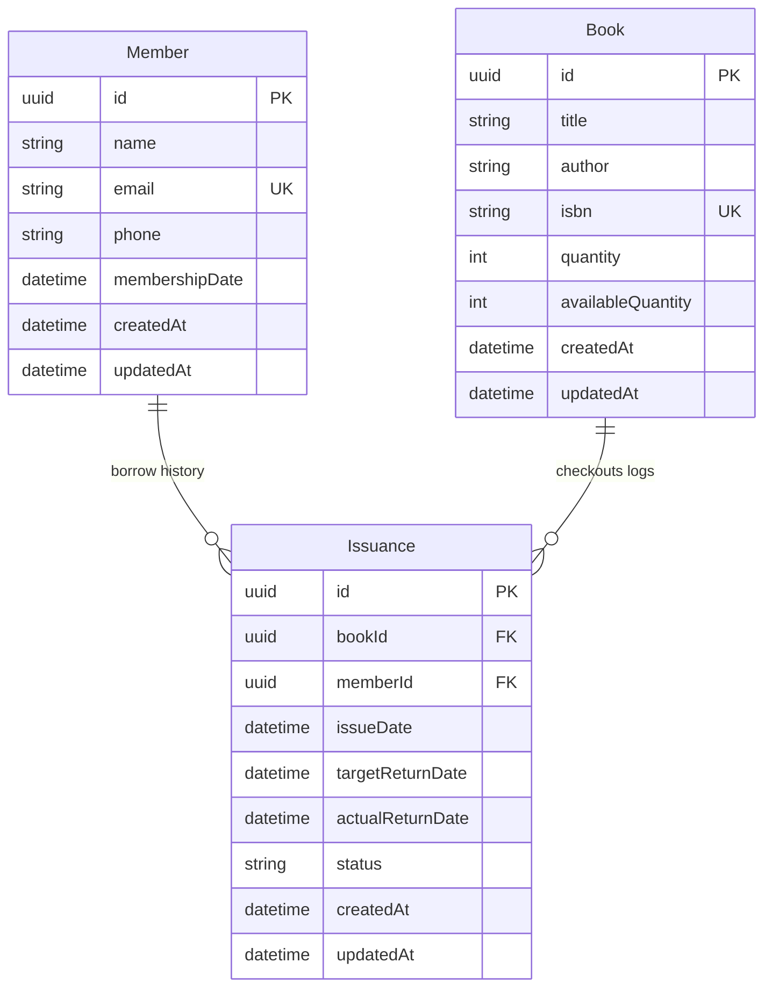

# LuminaLib System Architecture Manual

This manual provides a detailed architectural blueprint of the LuminaLib Library Management System, covering the monorepo layers, database relationships, data flow structures, transactional inventory states, and analytics query layouts.

---

## 🏗️ 1. Multi-Tier Monorepo Architecture

LuminaLib divides operational concerns across distinct decoupled microservices layers:

```text
    ┌────────────────────────┐
    │     React Client       │ <-- React 19, Vite, Tailwind CSS, Lucide icons
    └───────────┬────────────┘
                │ Authorization: Bearer <JWT>
                ▼
    ┌────────────────────────┐
    │   Express Router Gate  │ <-- Helmet, CORS, loggers, rate limits
    └───────────┬────────────┘
                │ Schema Validation
                ▼
    ┌────────────────────────┐
    │   Zod Input Scrubber   │ <-- Scrubber throws 400 Bad Request if invalid
    └───────────┬────────────┘
                │ Controllers Business Delegation
                ▼
    ┌────────────────────────┐
    │     Service Layer      │ <-- Core logic, calculations, aggregates
    └───────────┬────────────┘
                │ Prisma Client Queries
                ▼
    ┌────────────────────────┐
    │    PostgreSQL Database │ <-- Foreign Key Constraints, Indexes seeks
    └────────────────────────┘
```

### Decoupled Operational Layers
1. **Presentation Layer (Frontend)**: Standard Single Page Application (SPA). Employs React Context to hydrate credentials and user settings globally. Maps views (Dashboard, Members, Books, Transactions) within strict responsive layout frames.
2. **Network Layer (Axios Interceptors)**: Request interceptor injects Bearer session keys. Response interceptor intercepts `401 Unauthorized` states to automatically flush memory caches and redirect users to `/login`.
3. **Routing & Authentication Guards**: `<ProtectedRoute>` validates active session states before displaying private panels. `<PublicRoute>` blocks authenticated users from accessing public authentication pages.
4. **Validation Layer (Zod)**: Acts as the entry gate inside backend controllers, ensuring type safety and catching payload errors before processing data.
5. **Business Logic Layer (Services)**: Completely handles database integrations, calculations, counts, and aggregations.
6. **Data Storage Layer (PostgreSQL & Prisma)**: Houses normalized relations, mapping unique indexes and constraint structures.

---

## 🗄️ 2. Relational Database Schema & Entities

LuminaLib utilizes a strictly normalized relational schema:



### Relational Indexes Optimization
To guarantee maximum database search performance ($O(1)$ constant-time lookup seek operations) under high concurrent request volume:
* **Unique Indexes**: `isbn` (Book) and `email` (Member) fields.
* **Foreign Key Indexes**: Mapped on relations fields `bookId` and `memberId`.
* **Search / Filter Indexes**: Mapped on high-frequency search fields `status`, `issueDate`, and `targetReturnDate` to keep analytical aggregates calculations fast over millions of rows.

---

## 🔒 3. Authentication & API Security Flow

```text
    Client POST /auth/login  ──> Express Router ──> Rate Limiter ──> Zod Validate
                                                                           │
    GET /auth/me Access OK  <──  JWT Decrypted  <──  JWT verify  <──  DB verification (bcrypt compare)
```

1. **Brute-Force Limit Check**: The rate limiter restricts login attempts on `/auth/login` by IP.
2. **Credential Hashing Check**: Retrieves user records by email and hashes the incoming password using **bcrypt** ($O(1)$ validation).
3. **Stateless Session Issuance**: Signs and returns a stateless secure JWT containing User metadata (email, role, UUID).
4. **Endpoint Guard Validation**: Downstream protected controllers parse Bearer JWT headers, granting access to resources.

---

## ⚡ 4. Atomic Transactional Inventory Workflow

Ensuring inventory consistency is the most critical backend challenge. If a book is checked out, `availableQuantity` must decrement, and an `Issuance` log must be created. If any of these operations fail, the database state will become corrupt.

LuminaLib resolves this by wrapping operations inside an **Atomic Database Transaction** (`prisma.$transaction`):

```text
               POST /issuances (bookId, memberId)
                             │
                             ▼
                Start DB Transaction Block
                             │
            ┌────────────────┴────────────────┐
            ▼                                 ▼
      Read Book Catalog                 Read Member Profile
      (Validate stock > 0)              (Validate outstanding < 5)
            │                                 │
            └────────────────┬────────────────┘
                             ▼
                   Create Issuance Record
                   (status: 'ISSUED')
                             │
                             ▼
                   Update Book Quantity
                   (availableQuantity - 1)
                             │
                             ▼
                Commit Transaction Block
         (Rolls back fully if any step fails!)
```

### Double-Return Prevention Logic
To prevent corrupting book inventory counts when returning books (e.g. REST API client calls `/issuances/:id/return` repeatedly):
1. Reads Issuance record status.
2. If `status === 'RETURNED'`, the controller immediately throws a `400 Bad Request` block, preventing subsequent inventory increments:
   ```typescript
   if (issuance.status === 'RETURNED') {
     throw new BadRequestError('Book has already been returned.');
   }
   ```

---

## 📊 5. Relational SQL Analytics & Aggregations

To showcase elite PostgreSQL efficiency, LuminaLib writes highly optimized custom raw SQL joins (`prisma.$queryRaw`) to separate operational and analytical tasks:

### Left Join (Books Never Borrowed Report)
Captures book titles that have zero entries inside the Issuance junction records:
```sql
SELECT b.title AS "bookTitle", b.author
FROM "Book" b
LEFT JOIN "Issuance" i ON b.id = i."bookId"
WHERE i."bookId" IS NULL;
```

### Group By & Distinct counts (Top 10 Most Borrowed Books)
Aggregates borrow counts and counts unique readers using collapsing groupings:
```sql
SELECT 
  b.title AS "bookTitle", 
  COUNT(i.id)::int AS "borrowCount", 
  COUNT(DISTINCT i."memberId")::int AS "uniqueMembers"
FROM "Issuance" i
JOIN "Book" b ON i."bookId" = b.id
GROUP BY b.id, b.title
ORDER BY "borrowCount" DESC
LIMIT 10;
```
